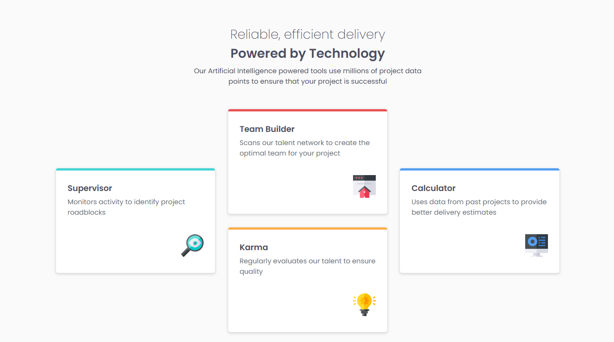

# Frontend Mentor - Four card feature section solution

This is a solution to the Four card feature section challenge on Frontend Mentor (https://www.frontendmentor.io/challenges/four-card-feature-section-weK1eFYK). Frontend Mentor challenges help you improve your coding skills by building realistic projects. 

## Table of contents

- [Overview](#overview)
  - [The challenge](#the-challenge) 
  - [Screenshot](#screenshot) 
  - [Links](#links)
- [My process](#my-process)
  - [Built with](#built-with) 
  - [What I learned](#what-i-learned)
  - [Continued development](#continued-development)
- [Author](#author) 

## Overview

### The challenge

Users should be able to:
- View the optimal layout for the site depending on their device's screen size

### Screenshot



This is a screenshot of my solution. 

### Links

- Solution URL: [https://www.frontendmentor.io/solutions/responsive-web-page-with-css-grid-5QbpyhYf6Z](https://www.frontendmentor.io/solutions/responsive-web-page-with-css-grid-5QbpyhYf6Z)
- Live Site URL: [https://ana-suzana.github.io/four-card-feature-section-web-page/](https://ana-suzana.github.io/four-card-feature-section-web-page/)

## My process

### Built with

- Semantic HTML5 markup
- CSS custom properties
- Flexbox
- CSS Grid

### What I learned

In this challenge, I learned and practice CSS grid. I had never used CSS grid in a web project before and now, after finished the challenge, I'm feeling more prepared for the future projects. I'm sure that it is a important technique and I want to practice it more. 

Some CSS properties that I used:

```css
.box-content{
    display: grid;
    grid-template-columns: repeat(3, 1fr); /*3 equal columns */
    grid-template-rows: repeat(2, 200px); /*2 lines with 200px height each*/
}
.box-content__supervisor {
    grid-column: 1; /*tells which column it should be positioned in*/
    grid-row: span 2; /*It takes up two lines*/
}
```

### Continued development

During the development of this challenge, I learned somethings about CSS grid and I want to practice more about this technique on my future projects. Plus, I realized that I need to learn more about positioning components because I'm not comfortable with the knowledge that I have on this subject.

## Author

- GitHub - [ana-suzana](https://github.com/ana-suzana)
- Frontend Mentor - [@ana-suzana](https://www.frontendmentor.io/profile/ana-suzana)
- LinkedIn - [Ana Tereza Suzana](www.linkedin.com/in/ana-tereza-suzana-32a706266)